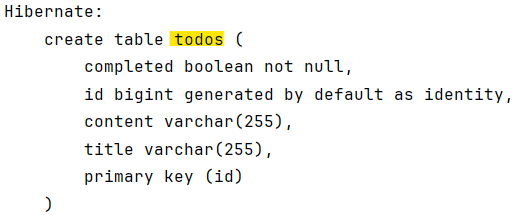

# 4.  JPA - CRUD4

# ✅ Todo 기능 구현 단계 정리

## 1) **TodoEntity 수정**

- JPA가 기본적으로 클래스 이름을 테이블명으로 사용하기 때문에, 원하는 테이블명을 사용하려면 `@Table` 필요.
- `@Table(name = "todos")` 추가하여 **todos 테이블**에 매핑되도록 설정.

```java
@Entity
@Table(name = "todos")
public class TodoEntity {
    ...
}
```

---

## 2) **todos 테이블 생성 확인**

- JPA 설정(`spring.jpa.hibernate.ddl-auto`)에 따라 자동으로 `todos` 테이블이 생성됨.
- 아래 그림과 같이 테이블 생성된 상태 확인.
    
    
    
    
    

---

## 3) **기존 TodoRepository 클래스 삭제**

- 과거에 클래스로 잘못 생성된 `TodoRepository` 삭제.
- “안전하게 삭제( Safe Delete )”  체크 박스 해제.
    
    
    

---

## 4) **TodoRepository 인터페이스 생성**

- JPA에서 Repository는 **class가 아니라 interface** 로 생성해야 함.
- `JpaRepository<TodoEntity, Long>` 상속하여 CRUD 메서드 자동 제공.

```java
public interface TodoRepository extends JpaRepository<TodoEntity, Long> {
}
```

### ✔ Repository → Service → Controller → View 순서로 흐름 구성

- **Entity**는 DB와 직접 연결되는 영역.
- **Repository**는 DB 접근 계층.
- **Service**는 비즈니스 로직 처리.
- **Controller**는 외부 요청 처리.
- **View/Client**는 응답 소비.

---

## 5) **TodoService에 toDto 메서드 추가**

- Entity를 클라이언트에 그대로 반환하는 것은 비권장.
- DTO로 변환하여 전달하기 때문에 `toDto()` 필요.
- `@Transactional` 추가
    - 쿼리 실행 실패 시 롤백처리
    - 코드가 끝나면 자동으로 save 처리

```java
@Transactional
@Service
public class TodoService {
	// TodoEntity -> TodoDTO
	private TodoDto toDto(TodoEntity entity) {
	    TodoDto dto = new TodoDto();
	    dto.setId(entity.getId());
	    dto.setTitle(entity.getTitle());
	    dto.setContent(entity.getContent());
	    dto.setCompleted(entity.isCompleted());
	    return dto;
	}
    ...
}
```

- TodoEntity
    
    ```java
    package com.example.todoapp.entity;
    
    import jakarta.persistence.*;
    
    // 디비 스키마 구성과 유사
    // 실제 디비와 연결되는 클래스
    @Entity
    @Table(name="todos")
    public class TodoEntity {
        @Id
        @GeneratedValue(strategy = GenerationType.IDENTITY)//autoIncrement 유사
        private Long id;
        private String title;
        private String content;
        private boolean completed;
    
        public TodoEntity() {
        }
    
        // id는 자동생성이라 빼도 됨
        public TodoEntity(String title, String content, boolean completed) {
            this.completed = completed;
            this.content = content;
            this.title = title;
        }
    
        public Long getId() {
            return id;
        }
    
        public String getTitle() {
            return title;
        }
    
        public void setTitle(String title) {
            this.title = title;
        }
    
        public String getContent() {
            return content;
        }
    
        public void setContent(String content) {
            this.content = content;
        }
    
        public boolean isCompleted() {
            return completed;
        }
    
        public void setCompleted(boolean completed) {
            this.completed = completed;
        }
    }
    
    ```
    
- TodoRepository
    
    ```java
    package com.example.todoapp.repository;
    
    import com.example.todoapp.entity.TodoEntity;
    import org.springframework.data.jpa.repository.JpaRepository;
    
    import java.util.List;
    
    public interface TodoRepository extends JpaRepository<TodoEntity, Long> {
        List<TodoEntity> findByTitleContaining(String keyword);
        List<TodoEntity> findByCompleted(boolean completed);
        long count();
        long countByCompleted(boolean completed);
        void deleteByCompleted(boolean completed);
    //    @Modifying
    //    @Query("DELETE FROM TodoEntity t WHERE t.completed = true")
    //    void deleteCompleted();
    }
    ```
    
- TodoService
    
    ```java
    package com.example.todoapp.service;
    
    import com.example.todoapp.dto.TodoDto;
    import com.example.todoapp.entity.TodoEntity;
    import com.example.todoapp.exception.ResourceNotFoundException;
    import com.example.todoapp.repository.TodoRepository;
    import org.springframework.stereotype.Service;
    import org.springframework.transaction.annotation.Transactional;
    
    import java.util.List;
    
    @Transactional
    @Service
    public class TodoService{
        private final TodoRepository todoRepository;
    
        public TodoService(TodoRepository todoRepository) {
            this.todoRepository = todoRepository;
        }
    
        public List<TodoDto> getAllTodos() {
            return todoRepository.findAll().stream()
                    .map(this::toDto)
                    .toList();
        }
    
        public TodoEntity findEntityById(Long id){
            return todoRepository.findById(id).orElseThrow(() -> new ResourceNotFoundException("not found : id = " + id));
        }
    
        public TodoDto getTodoById(Long id) {
            return toDto(findEntityById(id));
        }
    
        public TodoDto createTodo(TodoDto dto) {
            validateTitle(dto.getTitle());
            TodoEntity entity = new TodoEntity(
                    dto.getTitle(), dto.getContent(),dto.isCompleted()
            );
            TodoEntity saved = todoRepository.save(entity);
            return toDto(saved);
        }
    
        private void validateTitle(String title){
            if(title == null || title.trim().isEmpty()) {
                throw new IllegalArgumentException("제목은 필수입니다.");
            }
            if(title.trim().length() > 50){
                throw new IllegalArgumentException("제목은 50자를 초과할 수 없습니다.");
            }
        }
    
        public void deleteTodoById(Long id) {
            findEntityById(id);
            todoRepository.deleteById(id);
        }
    
        public TodoDto updateTodoById(Long id, TodoDto newDto) {
            validateTitle(newDto.getTitle());
            TodoEntity entity = findEntityById(id);
            entity.setTitle(newDto.getTitle());
            entity.setContent(newDto.getContent());
            entity.setCompleted(newDto.isCompleted());
            return toDto(entity);
        }
    
        public List<TodoDto> searchTodosByTitle(String keyword) {
            return todoRepository.findByTitleContaining(keyword).stream()
                    .map(this::toDto)
                    .toList();
        }
    
        public List<TodoDto> getTodosByCompleted(boolean completed) {
            return todoRepository.findByCompleted(completed).stream()
                    .map(this::toDto)
                    .toList();
        }
    
        public TodoDto toggleCompleted(Long id){
            TodoEntity entity = findEntityById(id);
            entity.setCompleted(!entity.isCompleted());
            return toDto(entity);
        }
    
        public void deleteCompletedTodos() {
            todoRepository.deleteByCompleted(true);
        }
    
        public long getTotalCount(){
            return todoRepository.count();
        }
    
        public long getCompletedCount(){
            return todoRepository.countByCompleted(true);
        }
    
        public long getActiveCount(){
            return todoRepository.countByCompleted(false);
        }
    
        // TodoEntity -> TodoDTO
        private TodoDto toDto(TodoEntity entity){
            TodoDto dto = new TodoDto();
            dto.setId(entity.getId());
            dto.setTitle(entity.getTitle());
            dto.setContent(entity.getContent());
            dto.setCompleted(entity.isCompleted());
            return dto;
        }
    }
    ```
    

---

## 6) 예외처리 커스텀

- exception 패키지 생성
- **ResourceNotFoundException** 클래스 생성 후 RuntimeException 클래스 상속
- **GlobalExceptionHandler** 클래스 생성
- `@ControllerAdvice` 추가
    - `@ControllerAdvice`는 여러 Controller에서 공통 예외 처리, 모델 바인딩, 초기화를 담당하며, 우선순위와 선택적 적용이 가능하고 글로벌/선택적 범위에서 동작
- ResourceNotFoundException
    
    ```java
    package com.example.todoapp.exception;
    
    public class ResourceNotFoundException extends RuntimeException{
        public ResourceNotFoundException(String message){
            super(message);
        }
    }
    ```
    
- GlobalExceptionHandler
    
    ```java
    package com.example.todoapp.service;
    
    import com.example.todoapp.dto.TodoDto;
    import com.example.todoapp.entity.TodoEntity;
    import com.example.todoapp.exception.ResourceNotFoundException;
    import com.example.todoapp.repository.TodoRepository;
    import org.springframework.stereotype.Service;
    import org.springframework.transaction.annotation.Transactional;
    
    import java.util.List;
    
    @Transactional
    @Service
    public class TodoService{
        private final TodoRepository todoRepository;
    
        public TodoService(TodoRepository todoRepository) {
            this.todoRepository = todoRepository;
        }
    
        public List<TodoDto> getAllTodos() {
            return todoRepository.findAll().stream()
                    .map(this::toDto)
                    .toList();
        }
    
        public TodoEntity findEntityById(Long id){
            return todoRepository.findById(id).orElseThrow(() -> new ResourceNotFoundException("not found : id = " + id));
        }
    
        public TodoDto getTodoById(Long id) {
            return toDto(findEntityById(id));
        }
    
        public TodoDto createTodo(TodoDto dto) {
            validateTitle(dto.getTitle());
            TodoEntity entity = new TodoEntity(
                    dto.getTitle(), dto.getContent(),dto.isCompleted()
            );
            TodoEntity saved = todoRepository.save(entity);
            return toDto(saved);
        }
    
        private void validateTitle(String title){
            if(title == null || title.trim().isEmpty()) {
                throw new IllegalArgumentException("제목은 필수입니다.");
            }
            if(title.trim().length() > 50){
                throw new IllegalArgumentException("제목은 50자를 초과할 수 없습니다.");
            }
        }
    
        public void deleteTodoById(Long id) {
            findEntityById(id);
            todoRepository.deleteById(id);
        }
    
        public TodoDto updateTodoById(Long id, TodoDto newDto) {
            validateTitle(newDto.getTitle());
            TodoEntity entity = findEntityById(id);
            entity.setTitle(newDto.getTitle());
            entity.setContent(newDto.getContent());
            entity.setCompleted(newDto.isCompleted());
            return toDto(entity);
        }
    
        public List<TodoDto> searchTodosByTitle(String keyword) {
            return todoRepository.findByTitleContaining(keyword).stream()
                    .map(this::toDto)
                    .toList();
        }
    
        public List<TodoDto> getTodosByCompleted(boolean completed) {
            return todoRepository.findByCompleted(completed).stream()
                    .map(this::toDto)
                    .toList();
        }
    
        public TodoDto toggleCompleted(Long id){
            TodoEntity entity = findEntityById(id);
            entity.setCompleted(!entity.isCompleted());
            return toDto(entity);
        }
    
        public void deleteCompletedTodos() {
            todoRepository.deleteByCompleted(true);
        }
    
        public long getTotalCount(){
            return todoRepository.count();
        }
    
        public long getCompletedCount(){
            return todoRepository.countByCompleted(true);
        }
    
        public long getActiveCount(){
            return todoRepository.countByCompleted(false);
        }
    
        // TodoEntity -> TodoDTO
        private TodoDto toDto(TodoEntity entity){
            TodoDto dto = new TodoDto();
            dto.setId(entity.getId());
            dto.setTitle(entity.getTitle());
            dto.setContent(entity.getContent());
            dto.setCompleted(entity.isCompleted());
            return dto;
        }
    }
    ```
    
- TodoController
    
    ```java
    package com.example.todoapp.controller;
    
    import com.example.todoapp.costant.TodoStatus;
    import com.example.todoapp.dto.TodoDto;
    import com.example.todoapp.exception.GlobalExceptionHandler;
    import com.example.todoapp.service.TodoService;
    import org.springframework.stereotype.Controller;
    import org.springframework.ui.Model;
    import org.springframework.web.bind.annotation.*;
    import org.springframework.web.servlet.mvc.support.RedirectAttributes;
    
    @Controller
    @RequestMapping("/todos")
    public class TodoController {
    // 이전 직접 접근
    //    private final TodoRepository todoRepository;
    //    public TodoController(TodoRepository todoRepository) {
    //        this.todoRepository = todoRepository;
    //    }
    
        private final TodoService todoService;
        public TodoController(TodoService todoService) {
            this.todoService = todoService;
        }
    
        @GetMapping
        public String todos(Model model) {
            model.addAttribute("todos", todoService.getAllTodos());
            model.addAttribute("todosCount", todoService.getTotalCount());
            model.addAttribute("completedCount", todoService.getCompletedCount());
            model.addAttribute("activeCount", todoService.getActiveCount());
            // status로 할 경우 삭제 시 flashmessage가 아래 데이터로 먹혀서 danger로 안보임
            model.addAttribute("check", TodoStatus.NORMAL.getCode());
            return "todos";
        }
    
        //생성 화면 렌더링
        @GetMapping("/new")
        public String newTodo(Model model) {
            model.addAttribute("todo", new TodoDto());
            return "form";
        }
    
        //실제 생성
        @PostMapping
        public String create(@ModelAttribute TodoDto todo,
                             RedirectAttributes redirectAttributes) {
            todoService.createTodo(todo);
            redirectAttributes.addFlashAttribute("message", "create todo!");//잠깐만 보여줌
            return "redirect:/todos";
        }
    
        @GetMapping("/{id}")
        public String detail(@PathVariable Long id, Model model){
            model.addAttribute("todo", todoService.getTodoById(id));
            return "detail";
        }
    
        @GetMapping("/{id}/delete")
        public String delete(@PathVariable Long id,
                             RedirectAttributes redirectAttributes) {
            todoService.deleteTodoById(id);
            redirectAttributes.addFlashAttribute("message", "deleted!");
            redirectAttributes.addFlashAttribute("status", TodoStatus.DANGER.getCode());
            return "redirect:/todos";
        }
    
        //수정 화면 렌더링
        @GetMapping("/{id}/update")
        public String edit(@PathVariable Long id, Model model) {
            model.addAttribute("todo", todoService.getTodoById(id));
            return "form";
        }
    
        //실제 수정
        @PostMapping("/{id}/update")
        public String update(@PathVariable Long id,
                             @ModelAttribute TodoDto todo,
                             RedirectAttributes redirectAttributes) {
            todoService.updateTodoById(id, todo);
            redirectAttributes.addFlashAttribute("message","update todo!");
            redirectAttributes.addFlashAttribute("status", TodoStatus.WARNING.getCode());
            return "redirect:/todos/" + id;
        }
    
        @GetMapping("/search")
        public String search(@RequestParam String keyword, Model model){
            model.addAttribute("todos", todoService.searchTodosByTitle(keyword));
            return "/todos";
        }
    
        @GetMapping("/active")
        public String active(Model model){
            model.addAttribute("todos", todoService.getTodosByCompleted(false));
            return "/todos";
        }
    
        @GetMapping("/completed")
        public String completed(Model model){
            model.addAttribute("todos", todoService.getTodosByCompleted(true));
            return "/todos";
        }
    
        @GetMapping("/{id}/toggle")
        public String toggle(@PathVariable Long id){
            todoService.toggleCompleted(id);
            return "redirect:/todos/" + id;
        }
    
        @GetMapping("/delete-completed")
        public String deleteCompletedTodos(RedirectAttributes redirectAttributes) {
            todoService.deleteCompletedTodos();
            redirectAttributes.addFlashAttribute("message", "완료된 할 일 전체 삭제!");
            redirectAttributes.addFlashAttribute("status", TodoStatus.DANGER.getCode());
            return "redirect:/todos";
        }
    }
    ```